

---

### 👩‍💻 Jenalyn Perez Ytac  

**IT Student · Flutter & Firebase Developer · Aspiring Full‑Stack Developer**

---

## 🚀 About Me

I'm **Jenalyn**, an **IT student** who loves learning by building real projects.  

Motivated IT student with hands-on experience in **Flutter**, **Firebase**, and building full-stack mobile applications. Passionate about backend development, API design, and crafting clean, maintainable systems.

- 🌱 Currently improving my **Flutter UI**, **backend logic**, and **database management** skills

- 🧩 I like breaking big problems into small, clear steps

- 🎯 Long‑term goal: become a **full‑stack developer** who can build and deploy complete apps

- 🎨 I love designing clean, modern, and accessible user interfaces that feel great on any device

---

## 🧰 Skills and Technologies

### Programming Languages

  

### Mobile Development

 

### Backend & Database

 

### Tools & Platforms

  

---

## 📱 Chair Classification App

My featured mobile project is a **Chair Classification** app, built with **Flutter** and a **TensorFlow Lite model**.

- **Purpose**: Help users identify different types of chairs quickly using their phone.

- **Core Features**:

  - 📷 **Scan & Identify** chair types from photos

  - 🧠 **On‑device ML model** using `.tflite` and `labels.txt`

  - 📊 **History & Analytics** to review previous scans

  - 🎨 **Modern, minimal UI** focused on clarity and ease of use

---

## 🖼️ App Screens (UI Preview)

| Home | Scan |
|:----:|:----:|
| 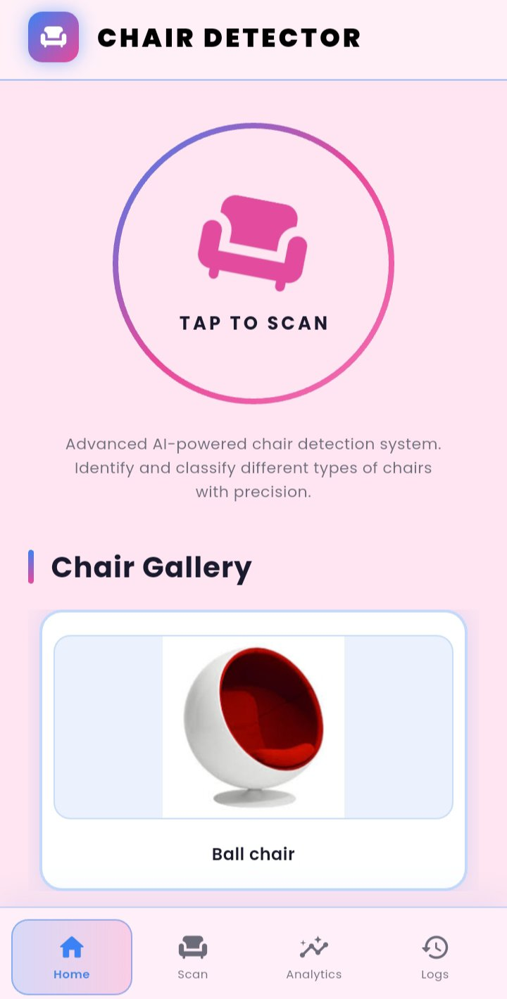 | 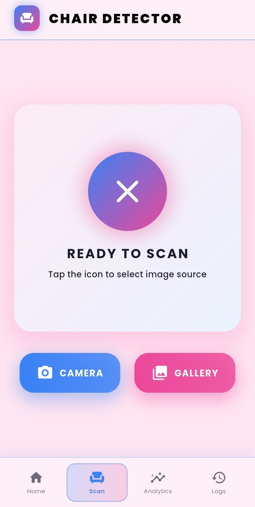 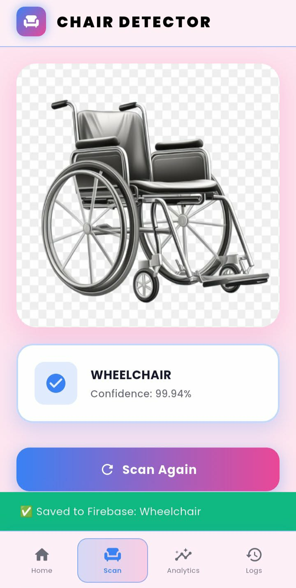 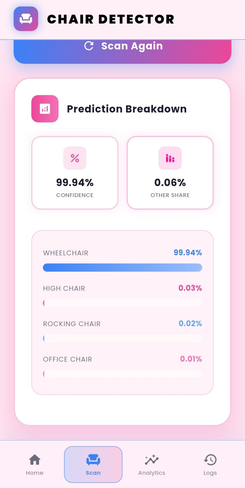 |

| Analytics | History |
|:---------:|:-------:|
| 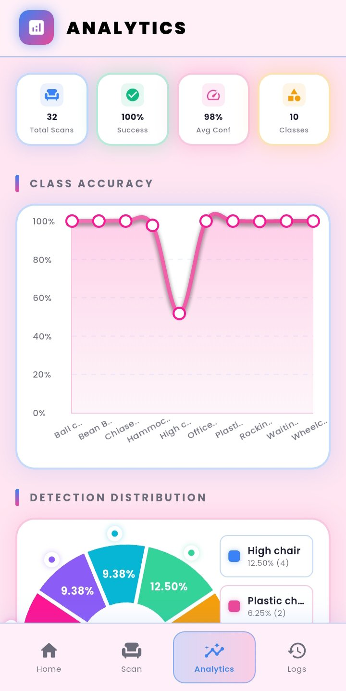 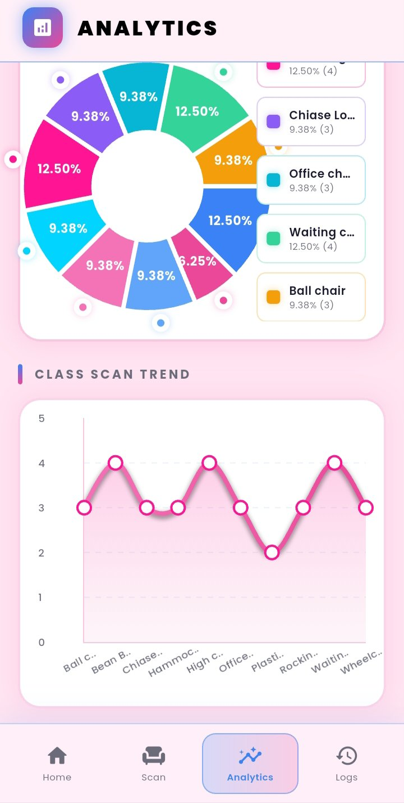 | 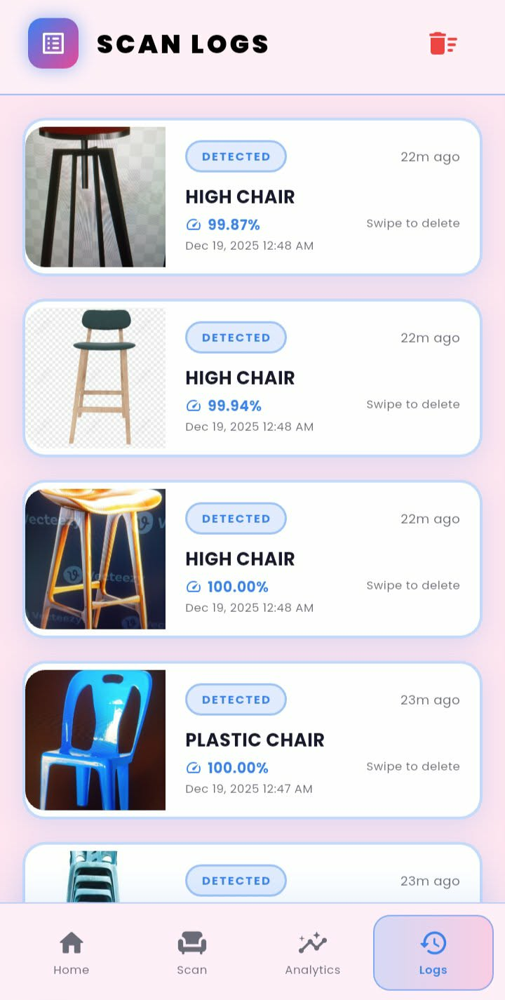 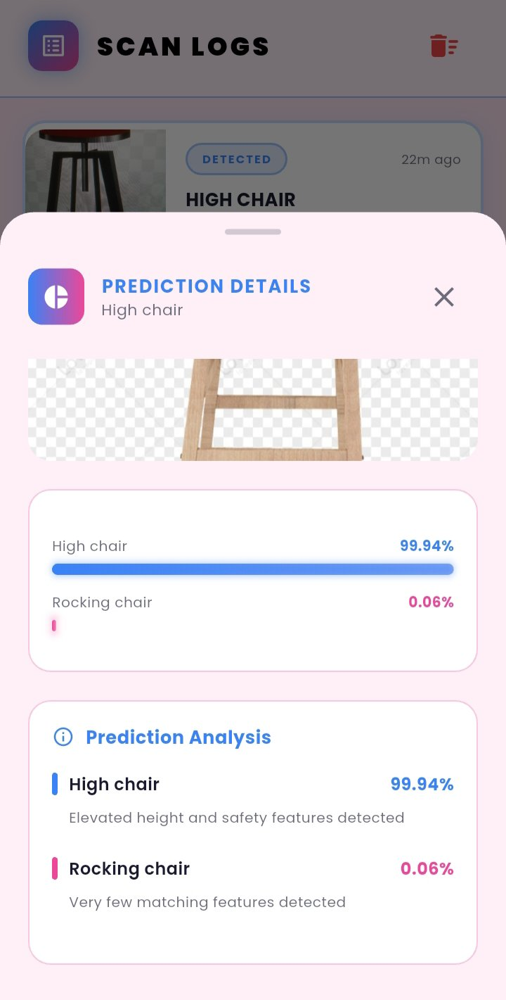 |

---

## 🪑 Chair Classes

| Chair Type | Preview | Description |
|:----------|:-------:|:------------|
| **Ball Chair** |  | A **spherical, modern seating option** designed for a unique and futuristic look, often used in contemporary interior design. |
| **Bean Bag Chair** |  | A **comfortable, casual seating option** filled with soft materials, perfect for relaxed lounging and informal spaces. |
| **Chaise Lounge Chair** |  | An **elongated, reclining chair** designed for relaxation, often found in living rooms or outdoor spaces. |
| **High Chair** |  | A **tall chair designed for infants and toddlers**, featuring safety straps and a tray, allowing children to sit at table height during meals. |
| **Hammock Chair** | 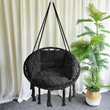 | A **suspended, swinging chair** made from fabric or rope, providing a comfortable and relaxing seating experience. |
| **Office Chair** | 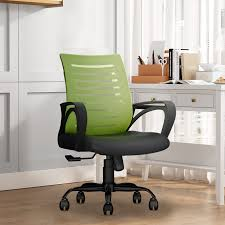 | An **ergonomic, adjustable chair** designed for desk work, featuring height adjustment, swivel capability, and lumbar support. |
| **Plastic Chair** | 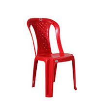 | A **lightweight, durable, and stackable chair** made from plastic, commonly used in outdoor settings, events, and casual dining areas. |
| **Rocking Chair** |  | A **classic chair** with curved legs that allow it to rock back and forth, providing a soothing motion. |
| **Waiting Chair** |  | A **simple, functional chair** commonly found in waiting areas, clinics, and public spaces, designed for temporary seating. |
| **Wheelchair** | 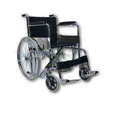 | A **mobility aid** with wheels, designed for individuals with mobility impairments, featuring manual or powered movement capabilities. |

## 💼 Other Featured Projects

| Project | Description | Tech Stack | Repository |
|:--------|:------------|:-----------|:-----------|
| **IT108 Class Activities** | Web development activities and fundamentals | `HTML` `CSS` `JavaScript` | [View Repo](https://github.com/jena1234586/Ytac_IT108) |
| **IT120 Class Activities** | Programming activities and exercises for IT120 | `Python` | [View Repo](https://github.com/jena1234586/YTAC_IT120_ACT1) |
| **YTAC_7OLAP_Systems_Diagram** | System architecture and OLAP systems diagram | `System Design` `OLAP` `UML / Diagrams` | [View Repo](https://github.com/jena1234586/YTAC_7OLAP_Systems_Diagram) |
| **Ytac_Chair_Classification_FinalProject** | Final project for chair classification using image processing | `Python` `Machine Learning` `Image Processing` | [View Repo](https://github.com/jena1234586/Ytac_Chair_Classification_FinalProject) |
| **YTAC-MongoDB-Activity** | MongoDB activity and exercises | `MongoDB` `JavaScript` | [View Repo](https://github.com/jena1234586/YTAC-MongoDB-Activity) |
| **Ytac_Mabras_FinalProject** | Academic final project | `Web Development` `Database` | [View Repo](https://github.com/jena1234586/Ytac_Mabras_FinalProject) |
| **mysql-trigger-implementation-ytac** | MySQL trigger implementation activities | `MySQL` `SQL` | [View Repo](https://github.com/jena1234586/mysql-trigger-implementation-ytac) |
| **Flutter_Widget_UIComponents** | Flutter widget and UI component samples | `Flutter` `Dart` | [View Repo](https://github.com/jena1234586/Flutter_Widget_UIComponents) |

---

## 📊 GitHub Stats

<!-- Main stats -->

<!-- Top languages -->

---

## 🎯 Learning Roadmap

- 📱 Build more **Flutter** apps with better navigation and state management  

- ☁️ Connect apps to **Firebase** (auth & database)  

- 🔧 Strengthening **backend logic** and database management  

- 🤖 Exploring **AI/ML integration** into mobile and web apps  

- ✍️ Writing **maintainable and production-ready** frontend code  

---

## 🎮 Hobbies & Interests

- 💻 **Coding** - Building projects and solving problems

- 🎮 **Gaming** - Enjoying video games in my free time

- 🎵 **Music** - Listening to music while coding

- 📚 **Reading** - Learning from tech blogs and documentation

- 📺 **Watching Videos** - Tech tutorials and entertainment

---

✨ **Thanks for visiting my profile!**  

Feel free to explore my repositories and follow my journey:  

👉 [github.com/jena1234586](https://github.com/jena1234586)

